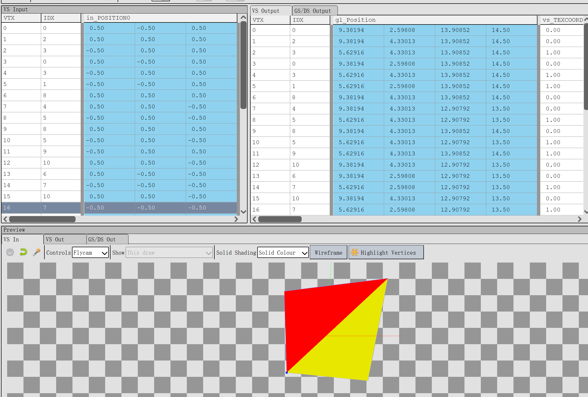

# unity_test_matrixRowCol
* test unity matrix row or col by decompile shader and render doc.
* box world position（2,3,4）
* camera world position (0,1,-10)
* objectToWorld matrix:
* * [1,0,0,0]
* * [0,1,0,0]
* * [0,0,1,0]
* * [2,3,4,1]

* view and project matrix:
* * [3.75278, 0,       0,       0]
* * [0,       1.73025, 0,       0]
* * [0,       0,       1.006,   1]
* * [0,       -1.73025,9.40582, 10]

## local pos（0.5,0.5,0.5）as sample，and world，view，clip postion：
* world pos(2.5,3.5,4.5)
* view pos = world pos - _WorldSpaceCameraPos.xyz
*          =(2.5,3.5,4.5) - (0,1,-10)
*          = 2.5,2.5,14.5

* view pos but with homogeneous pos = (viwpos.xyz,1)
*          = (2.5,2.5,14.5,1)

* clip pos =  world pos multiply view and project matrix
*          = (2.5,3.5,4.5,1) * vp
*          = (9.38194,4.33013,13.90852,14.5)  
* also = view homogeneous multiply project matrix
*   

## vertex-transform-pipeline

### complied-stand shader
    u_xlat0 = in_POSITION0.yyyy * hlslcc_mtx4x4unity_ObjectToWorld[1];
    u_xlat0 = hlslcc_mtx4x4unity_ObjectToWorld[0] * in_POSITION0.xxxx + u_xlat0;
    u_xlat0 = hlslcc_mtx4x4unity_ObjectToWorld[2] * in_POSITION0.zzzz + u_xlat0;
    u_xlat0 = u_xlat0 + hlslcc_mtx4x4unity_ObjectToWorld[3];
    u_xlat1 = u_xlat0.yyyy * hlslcc_mtx4x4unity_MatrixVP[1];
    u_xlat1 = hlslcc_mtx4x4unity_MatrixVP[0] * u_xlat0.xxxx + u_xlat1;
    u_xlat1 = hlslcc_mtx4x4unity_MatrixVP[2] * u_xlat0.zzzz + u_xlat1;
    gl_Position = hlslcc_mtx4x4unity_MatrixVP[3] * u_xlat0.wwww + u_xlat1;
    #ifdef UNITY_ADRENO_ES3
        u_xlatb0 = !!(_UVSec==0.0);
    #else
        u_xlatb0 = _UVSec==0.0;
    #endif
        u_xlat0.xy = (bool(u_xlatb0)) ? in_TEXCOORD0.xy : in_TEXCOORD1.xy;
        vs_TEXCOORD0.zw = u_xlat0.xy * _DetailAlbedoMap_ST.xy + _DetailAlbedoMap_ST.zw;
        vs_TEXCOORD0.xy = in_TEXCOORD0.xy * _MainTex_ST.xy + _MainTex_ST.zw;
        u_xlat16_2 = (-_Metallic) * 0.779083729 + 0.779083729;
        u_xlat0.x = (-u_xlat16_2) + _Glossiness;
        u_xlat0.w = u_xlat0.x + 1.0;
    #ifdef UNITY_ADRENO_ES3
        u_xlat0.w = min(max(u_xlat0.w, 0.0), 1.0);
    #else
        u_xlat0.w = clamp(u_xlat0.w, 0.0, 1.0);
    #endif
    u_xlat1.xyz = in_POSITION0.yyy * hlslcc_mtx4x4unity_ObjectToWorld[1].xyz;
    u_xlat1.xyz = hlslcc_mtx4x4unity_ObjectToWorld[0].xyz * in_POSITION0.xxx + u_xlat1.xyz;
    u_xlat1.xyz = hlslcc_mtx4x4unity_ObjectToWorld[2].xyz * in_POSITION0.zzz + u_xlat1.xyz;
    u_xlat1.xyz = hlslcc_mtx4x4unity_ObjectToWorld[3].xyz * in_POSITION0.www + u_xlat1.xyz;
    u_xlat1.xyz = u_xlat1.xyz + (-_WorldSpaceCameraPos.xyz);
    u_xlat10 = dot(u_xlat1.xyz, u_xlat1.xyz);
    u_xlat10 = inversesqrt(u_xlat10);
    u_xlat0.xyz = vec3(u_xlat10) * u_xlat1.xyz;
    vs_TEXCOORD1 = u_xlat0;
###

### box 对应的 gl_position

### matrix

